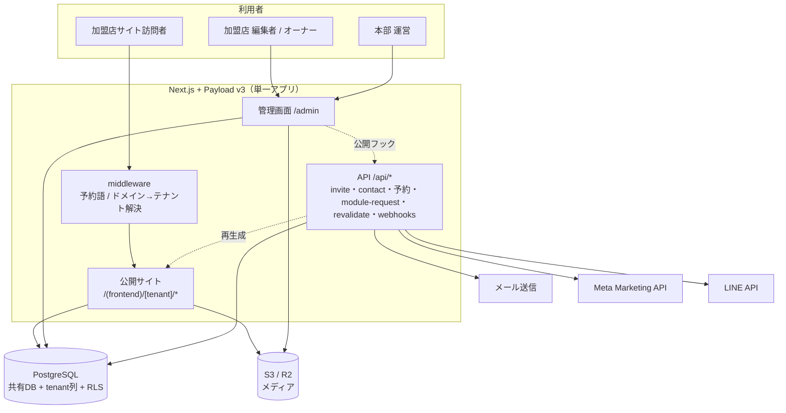
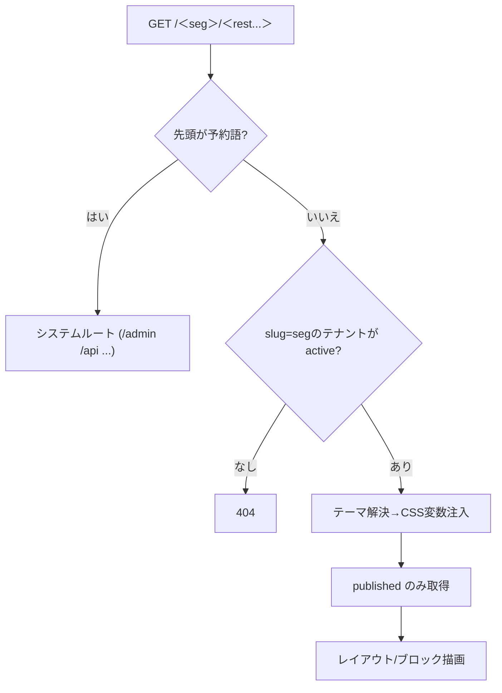
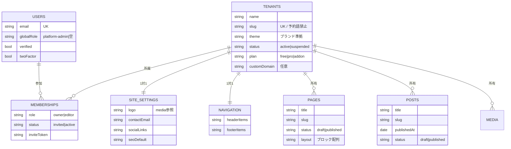
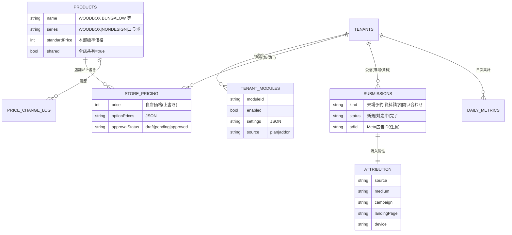
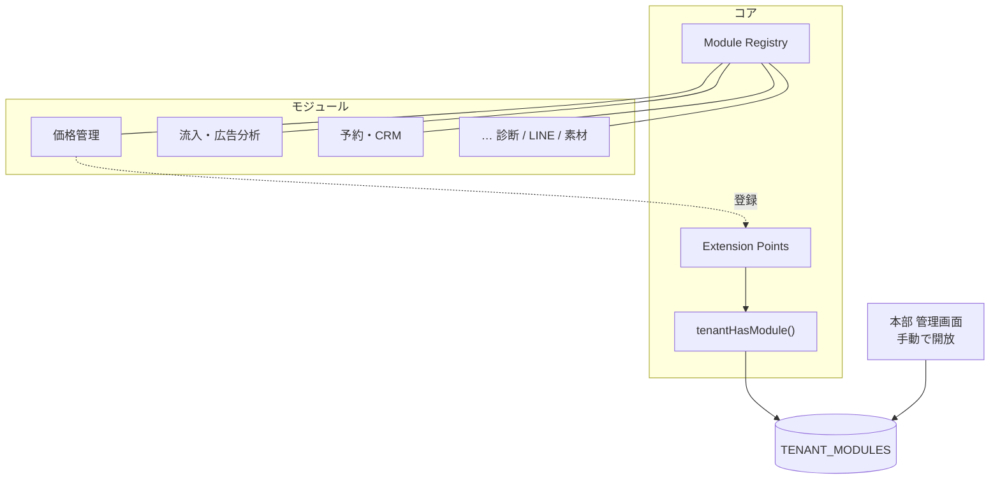
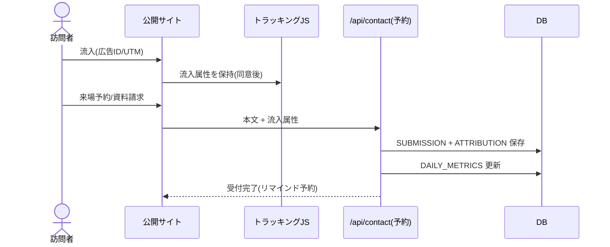

# UNSTANDARD 加盟店プラットフォーム ― システム設計図 v1.1

このドキュメントは、企画書で合意した方針を**実装に落とすための技術設計図（開発者向け）**である。
これまでの個別設計（マルチテナント基盤／モジュール基盤／価格管理／流入・広告分析／セキュリティ）を、
UNSTANDARDのフランチャイズ前提で統合した v1。詳細な各モジュール仕様は、本書を親として個別に展開する。

- 対象読者：開発・インフラ・本部の技術担当
- 位置づけ：企画書（What/Why）→ 本書（How）→ 各モジュール詳細仕様 → 実装
- 前提：テナント＝加盟店（工務店）、運営＝本部。コア＋モジュールのマルチテナントSaaS。

> **改訂 v1.1：** 既存WordPressサイトから**データ移行する**／**現行ドメインを継続使用する**／オプションは**セルフ課金ではなく本部が手動で開放する**、の3点を反映（詳細は §3.5・§7.1）。

---

## 1. 技術スタック（決定事項）

| 領域 | 採用 | 理由 |
|------|------|------|
| アプリ基盤 | Payload CMS v3（Next.js一体型・TypeScript） | 公開サイトと管理画面を1コードベース。マルチテナント公式プラグインあり |
| フロント | Next.js App Router | パス型ルーティング `/[tenant]`、ISR/オンデマンド再生成 |
| DB | PostgreSQL（共有DB＋tenant列、RLSを多層防御） | 行レベル分離で運用単純。強分離要件が出たら再検討 |
| メディア | S3 / Cloudflare R2（署名付きURL） | サーバーレス対応・テナント別アクセス制御 |
| ホスティング | Vercel 等（またはコンテナ） | GitHub連携の自動デプロイ |
| 認証 | Payload Auth（メール+パスワード、本部は2FA） | 招待・パスワード再設定を内包 |
| オプション開放 | 本部運用（管理画面で手動ON/OFF） | 加盟店の申請→本部が開放。セルフ登録/自動課金は不要 |
| 外部連携 | Meta Marketing API／LINE Messaging API／メール送信 | 広告分析・通知・確認/招待メール |

---

## 2. 全体アーキテクチャ



---

## 3. テナント・ルーティング設計

- 公開URLは**パス型**：`www.サービス名.com/＜加盟店slug＞/...`。`app/(frontend)/[tenant]/...` で実装。
- `middleware` で先頭セグメントを判定し、**予約語**（`admin` `api` `_next` `signup` 等）を遮断（衝突バグ防止）。
- 将来の**独自ドメイン**は `tenants.customDomain` を使い、middlewareでホスト名→テナント解決（パス型と併存可能）。
- 公開クエリは `status = published` のみ。下書きは認証付きプレビュー経路に分離。



---

## 3.5 既存サイト（WordPress）からの移行とドメイン継続

### 移行（WordPress → 新基盤）
方針は「**データは移行、見た目と仕組みは作り直し**」。

- **抽出**：WordPressの REST API（`/wp-json/wp/v2/...`）またはエクスポート（WXR/DB）から、記事・固定ページ・施工事例等のカスタム投稿・メディア・カスタムフィールド（ACF）を取得。
- **変換・投入**：Payload の Local API で各コレクションへ投入。本文HTMLは**リッチテキスト（lexical）へ変換＋整形**（最も手当てが要る工程）。
- **テナント割り当て**：マルチテナントのため、各コンテンツを正しい加盟店テナントへマッピング（既存サイトの店舗区分→`tenant`）。
- **メディア**：画像は S3/R2 へ再アップロードし、本文中のURLを書き換え。
- **進め方**：「読み取り→変換→投入」スクリプトを staging で試行 → 検証 → 反復。
- **移行できないもの**：WordPressのテーマ/デザイン・プラグインの動的機能は移行不可 → Next.js で作り直す。

### ドメイン継続
現行ドメインはそのまま使用できる。

- 新基盤を staging で用意 → **DNS（A/CNAME）を新ホスティングへ向け替えて切替（カットオーバー）**。
- **旧URL→新URLのリダイレクト設計**でSEOを維持。TLS証明書はホスティングが発行。メール（MX）には影響しない。
- マルチテナントのドメイン対応：本部ブランドサイトと加盟店サイトのドメイン/サブドメイン/パスを `tenant` へマッピング。加盟店が独自ドメインを持つ場合も `customDomain` で対応可能。
- 切替時は DNS TTL短縮・ダウンタイム最小化・リダイレクト整備を計画。

---

## 4. データモデル（コア）

`tenant` 列はマルチテナントプラグインが対象コレクションへ自動付与し、各加盟店は自店分のみ操作できる。
共有データ（本部管理）は `shared=true` で全店配信。



---

## 5. データモデル（モジュール拡張）



> 価格は2層解決（自店価格→なければ標準価格）。`PRODUCTS` は本部の共有コレクション。

---

## 6. 認証・認可・テナント分離

- **ロール**：本部=`platform-admin`（USERS）／加盟店=`owner`・`editor`（MEMBERSHIPS側で保持、テナント跨ぎ対応）。
- **テナント分離（最重要）**：
  - アクセス制御層（Payloadの access）で全コレクションにテナント条件を強制。
  - PostgreSQLの**行レベルセキュリティ（RLS）**を多層防御として併用。
  - **IDOR検証**（他店IDを差し替えて取得できないか）の自動テストを継続実施。
- **本部の横断権限**は監査ログ対象。個別の見込み客（PII）の閲覧は制限し、原則は集計・ベンチマークのみ（企画書5.4 リード所有権）。
- 招待トークンは**有効期限・単回使用**。本部管理者は**2FA必須**。

---

## 7. モジュール基盤（拡張の中核）

各機能は「マニフェスト＋拡張ポイントへの接続」で実装し、コア本体に依存させない。
有効化状態は `TENANT_MODULES` に保存し、`tenantHasModule()` 一つでアクセス制御・UI・公開JS注入・開放状態の反映に波及させる。



**拡張ポイント（最小セット）**：`onFormSubmission` ／ `injectPublicScript` ／ `registerDashboardWidget` ／ `registerAdminNav` ／ `registerSettingsTab` ／ `registerApiRoute` ／ `registerScheduledJob`。

### 7.1 オプションの開放方式（本部運用・セルフ課金なし）
- **セルフ登録・自動課金（Stripe等）は採用しない。** テナント作成・オーナー招待は本部がプロビジョニングする。
- 加盟店がオプションを希望 → 管理画面の「オプションを申し込む（本部へ問い合わせ）」または連絡 → **本部が `TENANT_MODULES.enabled=true` で開放**。
- 申請受付の簡易フロー：`/api/module-request`（加盟店→本部へ通知）。課金が必要な場合はフランチャイズの枠組みでオフライン処理。
- 利点：決済連携がMVPで不要。**公開セルフ登録という攻撃面が無くなり、セキュリティ上も有利**。

---

## 8. コンテンツ配信モデル（本部 ↔ 加盟店）

- **本部が中央管理（共有）**：商品（PRODUCTS）・ブランドメディア記事・標準価格・テーマ。更新は全店へ自動反映。
- **加盟店が編集（ローカル）**：見学会・イベント、施工事例、お客様の声、スタッフ、お知らせ、サイト設定、ナビ、価格上書き。
- **公開反映**：Payloadの afterChange フック → `/api/revalidate` でオンデマンド再生成（「公開したのに反映されない」を防止）。

---

## 9. 主要モジュールの設計要点

### 9.1 価格管理
2層価格（本部標準＋加盟店上書き）、`resolvePrice(tenant, product)` に解決ロジックを集約。本部に全店価格ビュー・監査ログ・任意の承認。法務配慮で本部は標準/参考価格に留める。

### 9.2 流入・広告分析（Meta連携）
公開サイトに first-party トラッキングJSを `injectPublicScript` で注入し、UTM・参照元・LP・広告ID（`ad.id` 等）を保持→ `onFormSubmission` で来場予約/資料請求に紐づけ→ `registerScheduledJob` でMarketing APIから創作物（画像・見出し・本文/キャプション）と実績（費用・CTR）を取得→ 創作物別・加盟店別・商品ライン別に分析。同意管理（CMP）連動で未同意時は計測しない。

### 9.3 予約・簡易CRM（核）
見学会・相談会のオンライン予約（空き枠・リマインド）と、リードの状態管理（新規→来場→商談→成約）。後段の広告ROI分析・成果可視化・LINE連携のデータ源。



---

## 10. セキュリティ実装（企画書 第9章の具体化）

| 項目 | 実装 |
|------|------|
| テナント分離 | access層で強制＋RLS＋IDOR自動テスト |
| 個人情報(APPI) | 同意管理(CMP)・利用目的明示・データ最小化・保持/削除・委託管理・漏えい報告体制 |
| 認証/権限 | 2FA(本部)・強パスワード・最小権限・招待トークン期限/単回 |
| 本部の越権 | リード所有権の技術担保・閲覧制限・監査ログ |
| シークレット | Meta/LINE等の外部APIキーはサーバー側暗号化保管・最小スコープ・ローテーション。クライアントに鍵を出さない |
| アプリ脆弱性 | XSS/SQLi/CSRF/SSRF/IDOR対策、リッチテキストのサニタイズ |
| アップロード | 画像限定・検証・署名付きURL・テナント別アクセス |
| スパム | reCAPTCHA＋レート制限＋メール確認 |
| インフラ/運用 | TLS・保存時暗号化・SCA・ログ監視・バックアップ・冗長化・SLA・インシデント対応・脆弱性診断 |

---

## 11. 環境・デプロイ・運用

- 環境分離（dev / staging / prod）。秘密情報は Secrets Manager。
- CI/CDで自動デプロイ。マイグレーションはレビュー・段階適用。
- 監視（エラー/パフォーマンス/可用性）、定期バックアップと復旧手順、SLAを定義（1基盤=全店波及のため冗長化）。

---

## 12. リポジトリ／ディレクトリ構成（スターター踏襲）

```
src/
├─ payload.config.ts            # DB・コレクション・multi-tenant・モジュール登録
├─ collections/                 # Tenants, Users, Pages, Posts, Media, Products, ...
├─ modules/                     # 各モジュール（manifest + hooks）
│   ├─ registry.ts              # Module Registry / tenantHasModule()
│   ├─ price-management/
│   ├─ lead-analytics/
│   └─ booking-crm/
├─ access/                      # テナントスコープ・ロール
├─ lib/                         # getTenant, resolvePrice 等
├─ themes/                      # ブランド準拠テーマ（CSS変数）
├─ middleware.ts                # 予約語・ドメイン解決
└─ app/
    ├─ (payload)/...            # 管理画面(生成)
    ├─ (frontend)/[tenant]/...  # 公開サイト
    └─ api/                     # invite, contact, 予約, module-request, revalidate, webhooks
```

---

## 13. 開発フェーズ（実装順）

1. **フェーズ0（基盤）**：マルチテナント基盤、テナント分離＋RLS＋IDORテスト、予約語middleware、メディアのクラウド保存、同意管理、モジュール基盤（Registry/`tenantHasModule()`/最小拡張ポイント）、本部プロビジョニング（テナント作成・オーナー招待）、既存WordPressからのデータ移行とドメイン切替、価格管理、予約の受け皿。
2. **フェーズ1（クイックウィン＋核）**：施工事例強化＋絞り込み、販促素材ライブラリ、“好き”診断、資料請求デジタル化、来場予約＋簡易CRM。パイロット加盟店で検証。
3. **フェーズ2（戦略投資）**：価格・資金シミュレーター、広告ROI分析（Meta連携）、LINE連携、成果可視化＋全国ベンチマーク。
4. **フェーズ3（深化）**：オンライン内覧、AIチャット相談、オーナーコミュニティ＋紹介、ローカルSEO/GBP。

---

## 14. 未決事項・確認ポイント（次工程で詰める）

- 既存 `unstandard-members.com`（LIFE QUARTET運営）／WordPressサイトの**移行は実施**で確定（§3.5）。残課題は、どのサイト・コンテンツをどの加盟店テナントへ割り当てるかの**マッピング詳細**。
- **現行ドメインは継続使用**で確定（§3.5）。残課題は**旧URL→新URLのリダイレクト設計**（SEO維持）と切替手順。
- オプションは**本部が手動で開放**（§7.1）。セルフ課金/決済連携はMVP不要で確定。
- 予約管理の連携先（既存の予約手段・カレンダー・LINE）。
- Meta以外の広告（Google/Yahoo）コネクタの優先度。

---

### 付録：本設計図の親子関係
- 親：企画書（方針・優先度・KPI・セキュリティ方針）
- 本書：統合システム設計図 v1（アーキテクチャ・データ・モジュール・セキュリティ実装・フェーズ）
- 子（次に展開）：各モジュール詳細仕様（価格管理／流入・広告分析／予約・CRM）＋画面設計＋API仕様
