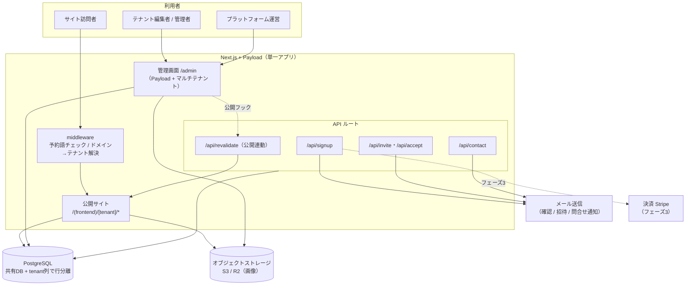
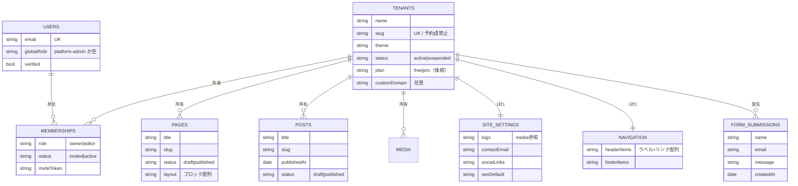
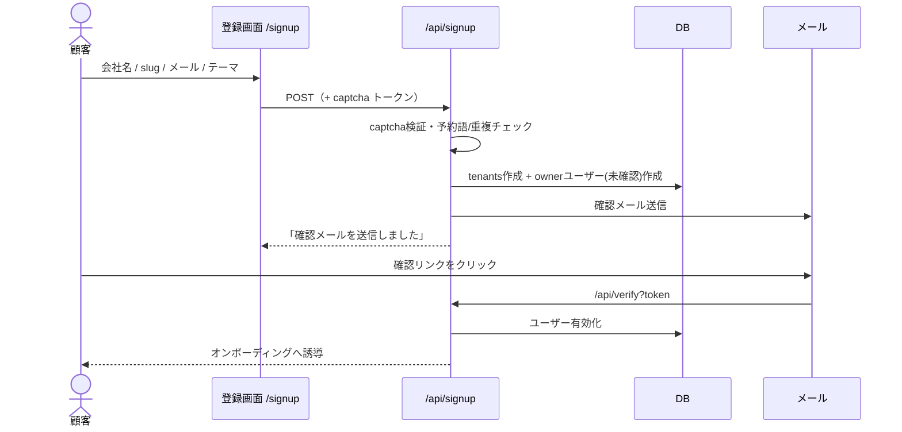
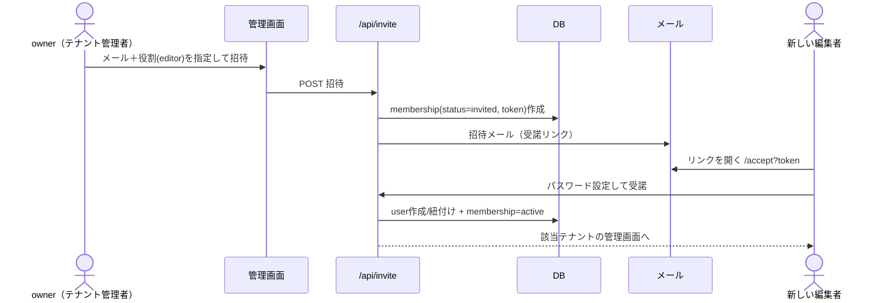
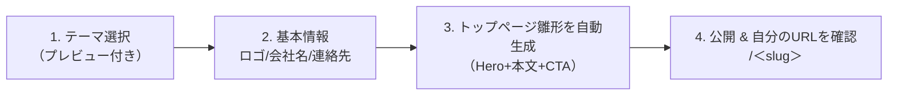
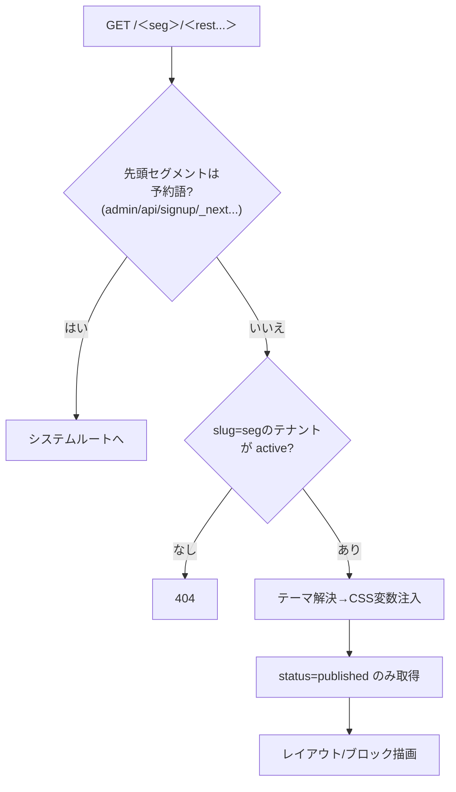
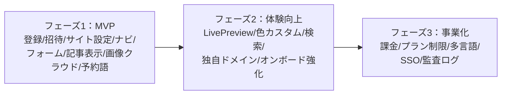

# マルチテナントCMS ― システム再定義 設計書（設計図）

対象システム：SaaS型マルチテナントCMS（顧客がセルフ登録し、自社コーポレートサイトを持てる）
構成：Payload CMS v3（Next.js一体型）＋ PostgreSQL／パス型ルーティング `/＜tenant＞`／テナント別テーマ

このドキュメントは、初版スターターを「ユーザー追加のしやすさ・機能の過不足・UI/UX」の観点で点検し、
設計を再定義したものです。図はそのまま実装の指針として使えます。

---

## 1. 現行スターターの分析（課題の棚卸し）

重要度：🔴=MVPで必須対応／🟡=早期に対応／⚪=後続でよい

### 1.1 ユーザー追加・オンボーディングのしやすさ
| # | 課題 | 影響 | 重要度 |
|---|------|------|--------|
| U1 | セルフ登録APIはあるが**登録画面（UI）が無い** | 顧客が自力で開始できない | 🔴 |
| U2 | **編集者の招待機能が無い** | 「誰でも編集したい」が実現できない。tenant-adminが同僚を呼べない | 🔴 |
| U3 | 最初の運営管理者を手動で `platform-admin` に昇格 | 初期構築が属人的・手順が不明瞭 | 🟡 |
| U4 | メール確認・パスワード再設定・招待トークンが未設計 | なりすまし登録／復旧不能のリスク | 🔴 |
| U5 | 登録後の**初回オンボーディング導線が無い** | 「登録したが何をすればいいか分からない」離脱 | 🟡 |

### 1.2 機能の過不足
| # | 課題 | 影響 | 重要度 |
|---|------|------|--------|
| F1 | ナビゲーションが `layout.tsx` に**ハードコード** | テナントがメニューを編集できない | 🔴 |
| F2 | テナント単位の**サイト設定（ロゴ/連絡先/SEO/SNS）が無い** | ブランディング・基本情報を出せない | 🔴 |
| F3 | お問い合わせフォームが無い | コーポレートサイトの必須要素が欠落 | 🔴 |
| F4 | 記事（お知らせ/ブログ）の**一覧・詳細ページが未実装** | コレクションはあるが表示できない | 🟡 |
| F5 | 公開反映がISRの時間ベース（60秒）のみ | 「公開したのに反映されない」混乱 | 🟡 |
| F6 | リッチテキストのHTML描画がスタブ | 本文が正しく表示されない | 🟡 |
| F7 | 課金・プラン制限が無い | SaaSとして収益化・利用制限ができない | ⚪ |
| F8 | 多言語・独自ドメイン | 要件次第。設計上の余地は確保 | ⚪ |

### 1.3 UI/UX
| # | 課題 | 影響 | 重要度 |
|---|------|------|--------|
| X1 | 素のPayload管理画面は非エンジニアに硬い（用語・ブロック概念） | 編集者がつまずく | 🟡 |
| X2 | tenant-adminでもテナント選択セレクターが出る | 1テナントの人には不要な操作 | 🟡 |
| X3 | 公開サイトにモバイルメニュー／レスポンシブ調整が無い | スマホ閲覧で破綻 | 🟡 |
| X4 | 下書きプレビュー（Live Preview）未接続 | 公開前に確認できない | ⚪ |

### 1.4 アーキテクチャ・セキュリティの見落とし
| # | 課題 | 影響 | 重要度 |
|---|------|------|--------|
| A1 | **予約スラッグ未対策**：`admin`/`api` 等とパスが衝突 | ルーティング破壊（潜在バグ） | 🔴 |
| A2 | メディアが**ローカル保存**（staticDir） | Vercel等サーバーレスで動かない | 🔴 |
| A3 | 公開クエリで**下書きを除外していない**可能性 | 未公開が露出する恐れ | 🔴 |
| A4 | 登録の**captcha/レート制限/メール確認が無い** | スパムテナント量産 | 🔴 |
| A5 | テナント分離のアクセス制御テストが無い | 情報漏えいリスク | 🟡 |

---

## 2. 再定義した全体アーキテクチャ

要点
- 公開・管理・APIを**1コードベース**に集約（Payloadの強み）。運用対象が1つで済む。
- middlewareを新設し、**予約スラッグの遮断（A1）**と将来の独自ドメイン解決（F8）を一手に担う。
- メディアは**クラウドストレージ**へ（A2）。メール・決済は外部サービスに分離。

---

## 3. データモデル（再設計）

初版の不足（ナビ・サイト設定・招待・フォーム）を補ったモデル。
`tenant` 列は multi-tenant プラグインが各コレクションへ自動付与。

初版からの主な追加
- **MEMBERSHIPS**：ユーザーとテナントの多対多＋役割＋招待状態。これが**招待による編集者追加（U2）**の基盤。
- **SITE_SETTINGS / NAVIGATION**：ロゴ・連絡先・**編集可能なメニュー（F1, F2）**。
- **FORM_SUBMISSIONS**：お問い合わせ受信（F3）。
- TENANTS/PAGES/POSTSに `status`・`plan` を明示し、**下書き露出（A3）**と将来の課金制御を設計に組み込み。

---

## 4. ユーザー・ロール設計とオンボーディング（重点テーマ）

### 4.1 ロール再定義
| ロール | 範囲 | できること |
|--------|------|------------|
| platform-admin | 全テナント横断（運営） | 全テナント・ユーザー管理、停止、設定 |
| owner（テナント） | 自テナント | 編集すべて＋**メンバー招待**＋サイト設定＋テーマ変更 |
| editor（テナント） | 自テナント | ページ・記事の作成編集（招待・課金は不可） |

役割は **MEMBERSHIPS 側で持つ**（ユーザーはテナントを跨げる）。運営権限のみ USERS に持たせる。

### 4.2 セルフ登録フロー（U1, U4, A4 を解決）

### 4.3 メンバー招待フロー（U2 を解決 ＝「誰でも編集」の核）

→ 既存ユーザーなら新テナントを追加紐付け、未登録なら新規作成。**1クリック招待＋メールリンク**で完結。

### 4.4 初回オンボーディング・ウィザード（U5, U3）
登録直後に3〜4ステップのガイドを表示し、空サイトを避ける。

※運営の初期管理者（U3）は、シードスクリプトで「最初の登録ユーザーを自動で platform-admin にする」方式に変更。

---

## 5. 公開サイトのルーティングと表示

- **予約スラッグ表（A1）**を middleware と登録バリデーションの両方で適用。
- 公開クエリは **published 限定（A3）**。プレビューは認証付きの `?draft=true` 経路に分離。
- 公開反映は**オンデマンド再生成（F5）**：Payloadの afterChange フック → `/api/revalidate` を叩く。

---

## 6. 機能一覧（優先度マップ）

| 分類 | MVP（フェーズ1） | フェーズ2 | フェーズ3 |
|------|------------------|-----------|-----------|
| ユーザー | セルフ登録＋メール確認、**メンバー招待**、パスワード再設定 | SSO、2要素認証 | 監査ログ |
| サイト管理 | **編集可能ナビ**、**サイト設定（ロゴ/連絡先/SEO）**、テーマ選択 | 複数テーマ＋色カスタム、Live Preview | テーマ自作・CSS注入 |
| コンテンツ | ブロック式ページ、お知らせ/ブログ**一覧・詳細** | カテゴリ/タグ、検索 | 多言語 |
| 集客導線 | **お問い合わせフォーム**（受信＋通知） | フォームビルダー、reCAPTCHA | MA連携 |
| 公開/配信 | 公開連動の再生成、画像のクラウド保存 | 独自ドメイン | CDN最適化・画像変換 |
| 課金 | （無料運用） | プラン制限の素地 | Stripeサブスク・従量制限 |

---

## 7. UI/UX 改善方針

### 公開サイト
テーマはCSS変数で統一済みのため、**レスポンシブ規則とモバイルメニュー（X3）**を共通レイヤーに追加すれば全テーマに波及する。リッチテキストは lexical の公式HTMLコンバータで描画（F6）。各テーマに「余白・行間・コントラスト」のアクセシビリティ下限を設ける。

### 管理画面（編集者体験 ― 非エンジニア対応）
- **入口を分ける**：owner/editor がログインしたら**自テナントに自動スコープ**し、テナントセレクターを隠す（X2）。運営だけセレクターを表示。
- **やさしいラベル**：コレクション名・フィールドに日本語ラベルと補足説明（プレースホルダ/例）を付ける（X1）。「ブロック」は「パーツを積み重ねて作る」と説明文で補助。
- **Live Preview**：編集画面の横に実サイトの即時プレビュー（フェーズ2）。
- **ダッシュボード**：ログイン直後に「サイトを見る／お知らせを書く／メンバーを招待」の大きな導線を出す。

### オンボーディング
4.4のウィザードで「登録→公開」までを最短化。空状態には例文入りの雛形を自動投入し、**最初の成功体験**を作る。

---

## 8. 主要な技術判断・リスク

| 項目 | 判断 | 理由 / 補足 |
|------|------|-------------|
| テナント分離 | 共有DB＋tenant列（プラグイン） | 運用が単純。強分離要件が出たらDB分割を検討 |
| 予約スラッグ | middleware＋登録時バリデーションで二重防御 | A1の確実な回避 |
| 画像保存 | S3/R2（`@payloadcms/plugin-cloud-storage`） | サーバーレス対応（A2） |
| 登録スパム | captcha＋レート制限＋メール確認 | A4。無料SaaSは特に必須 |
| 公開反映 | afterChainフックでオンデマンド再生成 | 体感の即時性（F5） |
| フォーム | 自作 or `@payloadcms/plugin-form-builder` | Payloadにフォーム標準機能は無い |
| 独自ドメイン | customDomain列＋ホスト名解決（後続） | パス型と併存可能 |

---

## 9. 実装ロードマップ

優先着手（MVPの中でも最初の塊）
1. 予約スラッグ＋公開published限定（壊れ・漏れの防止）
2. メンバー招待フロー（要件の核「誰でも編集」）
3. サイト設定＋編集可能ナビ（コーポレートサイトとして成立させる）
4. お問い合わせフォーム＋画像クラウド保存

---

### 付録：初版からの変更点サマリ
- データモデルに MEMBERSHIPS / SITE_SETTINGS / NAVIGATION / FORM_SUBMISSIONS を追加
- ロールを USERS固定から **MEMBERSHIPSベース**へ（テナント跨ぎ＋招待に対応）
- middleware新設（予約語・ドメイン解決）／画像をクラウド保存へ
- 管理画面は「自テナント自動スコープ＋日本語ラベル＋ダッシュボード」で非エンジニア最適化
