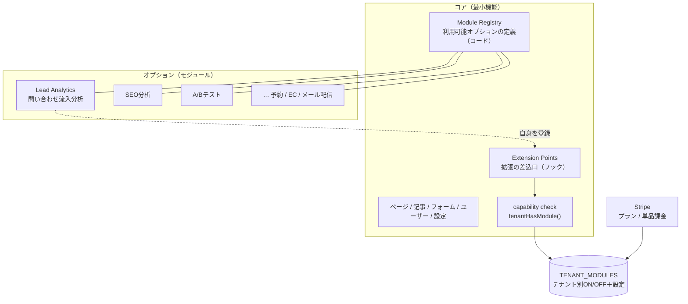
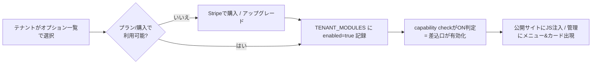
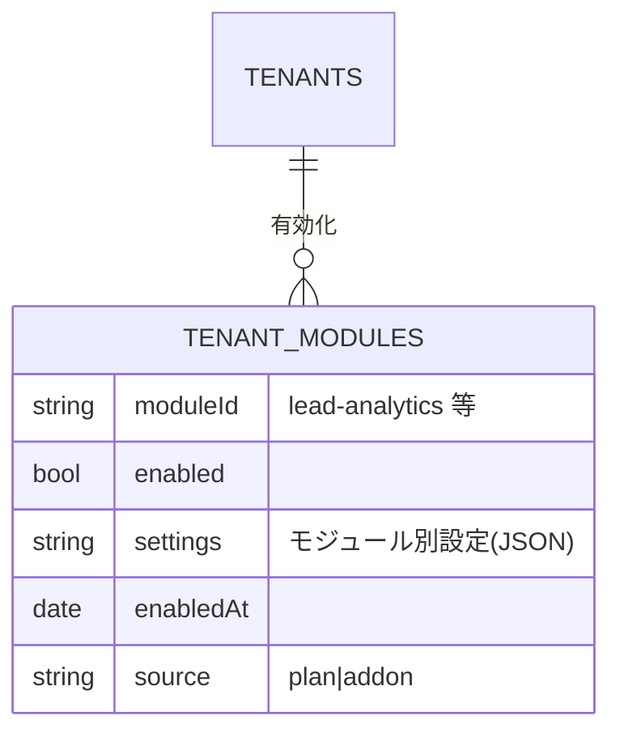
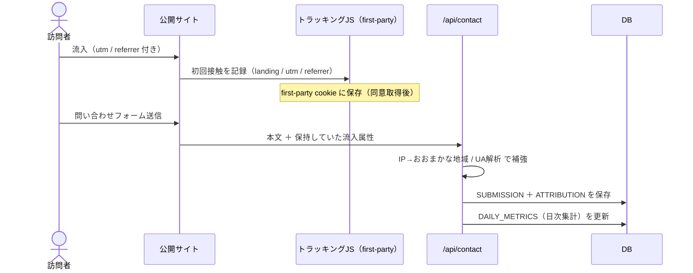
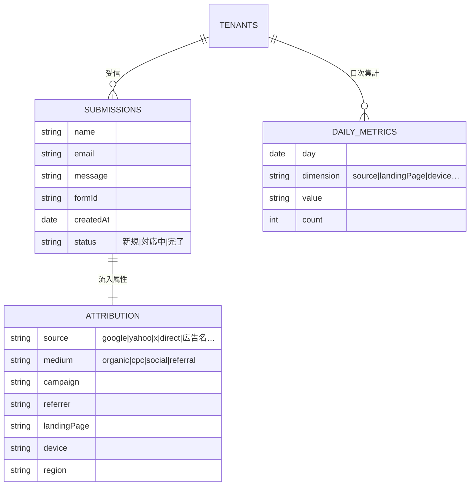

# 設計書 追補：拡張オプション・アーキテクチャ ＋ 問い合わせ流入分析モジュール

前提：本体は「SaaS型マルチテナントCMS（Payload v3＋Next.js／パス型ルーティング／テナント別テーマ）」。
本書は **「コアは最小限・機能はオプション（モジュール）で後付けし、テナント単位でON/OFF・課金できる」** 拡張基盤と、
その最初の旗艦モジュール **「問い合わせ流入分析」** を定義する。

---

## 1. コンセプト

- **コア（最小機能）**：ページ／記事／フォーム／ユーザー／サイト設定。どのテナントも共通で持つ。
- **オプション（モジュール）**：流入分析・SEO分析・A/Bテスト・予約・EC連携 など。**後から追加でき、テナントごとに有効化**。
- **課金ゲート**：プラン同梱 or 単品購入（à la carte）。有効化は課金状態に連動。
- 設計の肝は「**モジュールを“疎結合の差込部品”として定義し、決まった差込口（拡張ポイント）にだけ接続させる**」こと。コアはモジュールの中身を知らなくても動く。

---

## 2. 拡張アーキテクチャ（モジュール基盤）



### 2.1 モジュールの定義（マニフェスト）
各モジュールは「自己紹介カード＋差込部品」を1ファイルで宣言する。

```ts
// 概念イメージ（実装時の型）
type ModuleManifest = {
  id: 'lead-analytics'
  name: '問い合わせ流入分析'
  description: '問い合わせがどこから来たかを計測・集計し、戦略に活かす'
  requiredPlan: 'pro' | 'addon'          // 課金ゲート
  collections?: CollectionConfig[]        // 追加するデータ（Payloadへ）
  settingsSchema?: Field[]                // テナント別設定UIの項目
  hooks?: Partial<ExtensionPoints>        // 下記の差込口に接続
}
```

### 2.2 拡張ポイント（差込口）一覧
モジュールはこの“決められた口”にだけ接続する。コアは口を提供するだけで中身に依存しない。

| 拡張ポイント | 発火タイミング | 流入分析での使い方 |
|--------------|----------------|--------------------|
| `onFormSubmission(submission, ctx)` | 問い合わせ受信時 | 流入属性を付与して保存・集計更新 |
| `injectPublicScript(tenant)` | 公開サイトの `<head>` | first-partyトラッキングJSを注入 |
| `registerDashboardWidget` | 管理ダッシュボード描画 | 分析カードを追加 |
| `registerAdminNav` | 管理メニュー | 「分析」メニューを追加 |
| `registerSettingsTab` | テナント設定画面 | 計測・同意設定UIを追加 |
| `registerApiRoute` | API登録 | 集計取得 / CSVエクスポート |
| `registerScheduledJob` | 定期実行 | 日次集計・週次レポート生成 |

### 2.3 有効化フローと課金ゲート


`tenantHasModule(tenant, 'lead-analytics')` を**アクセス制御・UI表示・API・公開JS注入**のすべてで参照する。
これ1つでON/OFFが全レイヤーに波及するため、モジュールの足し引きが安全。

---

## 3. データモデル（モジュール基盤）


- モジュール“カタログ”自体はコード（Module Registry）で持ち、**有効化状態と設定だけをDB（TENANT_MODULES）**に保存。
- これによりモジュール追加＝コードに1ファイル追加＋カタログ登録で完結（DBマイグレーションは追加コレクション分のみ）。

---

## 4. 旗艦モジュール：問い合わせ流入分析（Lead Analytics）

「問い合わせがどこから来たか」を計測・集計し、戦略立案に使えるようにする。

### 4.1 何を計測するか（流入属性）
| 区分 | 項目 |
|------|------|
| 流入元 | utm_source / medium / campaign / term / content、参照元(referrer)、検索/SNS/広告/直接の判別 |
| 経路 | ランディングページ（初回接触ページ）、問い合わせ送信ページ、初回接触〜送信の経過 |
| 環境 | デバイス（PC/SP/タブレット）、ブラウザ、おおまかな地域（IP→国/都道府県、個人特定はしない） |
| 成果 | フォーム表示数・送信数・送信率（簡易ファネル） |

### 4.2 計測の仕組み（first-party／プライバシー配慮）
外部トラッキングに頼らず、**自社ドメインの軽量JS**で初回接触情報を保持し、送信時に問い合わせへ紐づける。



### 4.3 データモデル（モジュール追加分）

日次集計（DAILY_METRICS）を**事前に積む**ことで、ダッシュボードは生ログを毎回走査せず高速表示。

### 4.4 集計・分析ダッシュボード（主要指標）
- 期間内の **問い合わせ件数の推移**（折れ線）と前期間比
- **流入元別の内訳**（organic / 広告 / SNS / 参照 / 直接）と件数ランキング
- **ランディングページ別**の問い合わせ貢献度（どのページが商談を生むか）
- **デバイス／地域**の構成
- 簡易**ファネル**（表示→送信の送信率）
- 個別問い合わせに「流入元」が紐づき、対応状況も管理

> 具体的な画面は別添のモックアップ（`リード分析ダッシュボード.html`）を参照。

### 4.5 戦略インサイト（分析→戦略の橋渡し）
集計の“読み解き”を自動化し、次の打ち手につなげる層。

- **ルールベース**：前期間比で伸びた/落ちた流入元、送信率が高い/低いランディングページ、未対応の滞留などを自動でハイライト。
- **AIインサイト（上位オプション）**：集計結果を要約し、「広告Aは件数は多いが送信率が低い→LP改善 or 出稿見直し」等の改善提案文を生成（サーバー側でClaude APIを呼び出し）。
- レポートの**定期配信**（週次メール）＝ `registerScheduledJob` を使用。

### 4.6 プライバシー・法令
- 計測は**first-party**中心。IPからの地域推定は粗い粒度に留め、**個人を特定しない**。
- 公開サイトに**Cookie同意バナー**を出し、同意後に計測。プライバシーポリシー雛形を提供。
- 個人情報保護法・（対象地域があればGDPR）に配慮。データ保持期間・削除をテナント設定で制御。

---

## 5. オプション販売（課金）
- **プラン同梱**：Proプランに分析を含める／**単品アドオン**：基本プラン＋月額で分析だけ追加、の両対応。
- Stripeの購読状態 → `TENANT_MODULES.enabled` に反映。停止/解約で自動的にOFF（差込口も無効化）。
- 価格は「件数」「保持期間」「AIインサイトの有無」で段階を作りやすい。

---

## 6. 同じ仕組みで増やせるモジュール例
| モジュール | 提供価値 | 主に使う拡張ポイント |
|------------|----------|----------------------|
| SEO分析 | 検索流入・順位・改善提案 | scheduledJob / dashboardWidget |
| A/Bテスト | LP・CTAの出し分けと勝敗判定 | injectPublicScript / apiRoute |
| 予約受付 | 来店/相談予約フォーム＋通知 | collections / formSubmission |
| メール配信 | 問い合わせ者へのフォロー配信 | formSubmission / scheduledJob |
| EC連携 | 簡易商品掲載・カート | collections / publicScript |

いずれも「マニフェスト＋差込口」の同じ作法で追加でき、**コア改修なしに機能拡張**できる。

---

## 7. ロードマップへの反映
1. **モジュール基盤を先に作る**：Module Registry／`tenantHasModule()`／TENANT_MODULES／拡張ポイント（最小は `onFormSubmission`・`registerDashboardWidget`・`injectPublicScript`）。
2. 第1モジュール＝**問い合わせ流入分析（集計まで）**を実装し、基盤を実証。
3. **戦略インサイト**（ルールベース→AI）と**課金連動**を追加。
4. 以降は SEO分析・A/Bテスト等を同じ作法で順次追加。

> 基盤を最初に薄く作っておくと、2個目以降のオプションは“載せるだけ”になる。これが拡張性の本質。
