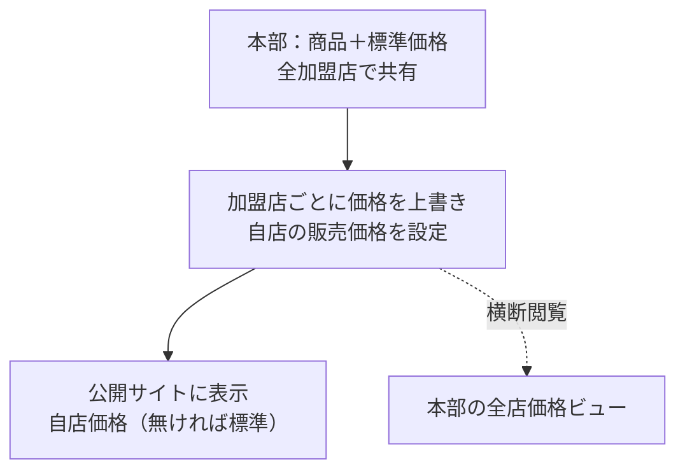
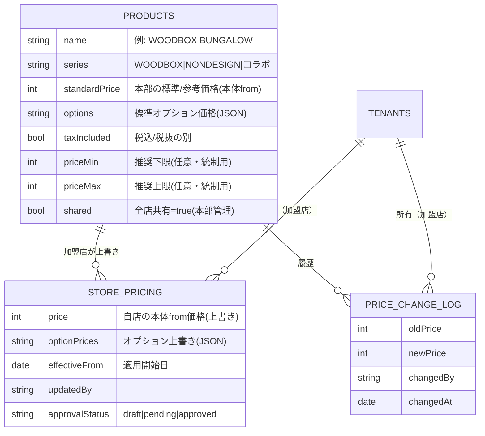
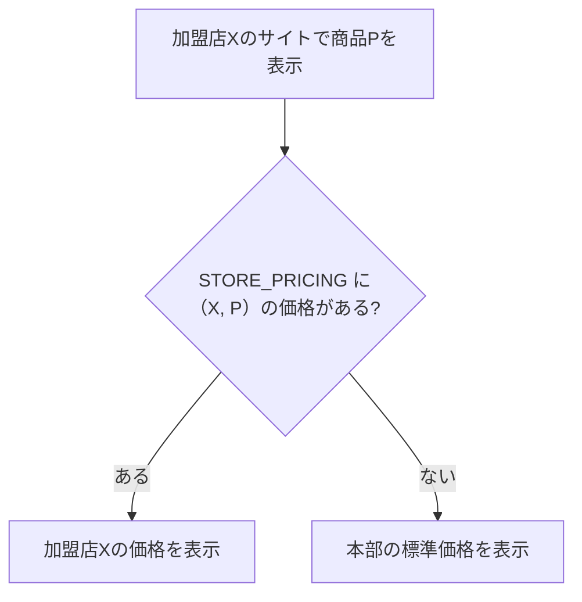

# 設計書 追補：価格管理モジュール（加盟店別プライシング）

前提：本体は「SaaS型マルチテナントCMS（フランチャイズ版）」。テナント＝UNSTANDARD加盟店（工務店）、運営＝本部。
本書は拡張オプションのひとつ **「価格管理モジュール」** を、既存のモジュール基盤（マニフェスト＋拡張ポイント）に乗る形で定義する。

要件
- 商品の価格を **加盟店ごとに変更できる**。
- ただし **本部はすべての加盟店の価格を閲覧できる**。

---

## 1. コンセプト：価格を「2層」で持つ

- **本部層（共有）**：商品マスタに「標準価格（参考価格）」を持ち、全加盟店に共有する。
- **加盟店層（上書き）**：各加盟店が自店の販売価格を上書きできる。
- **公開サイト表示**：加盟店の価格を表示。未設定なら本部の標準価格にフォールバック。
- **本部の可視化**：本部（platform-admin）は全加盟店にアクセスできるため、全店の価格を横断で閲覧できる。



---

## 2. モジュール定義（マニフェスト）

```ts
const PriceManagementModule: ModuleManifest = {
  id: 'price-management',
  name: '価格管理（加盟店別プライシング）',
  description: '加盟店ごとに商品価格を設定でき、本部は全店の価格を横断で閲覧・モニタリングできる',
  requiredPlan: 'addon',          // 課金ゲート（プラン同梱 or 単品）
  collections: [Products, StorePricing, PriceChangeLog],
  settingsSchema: [ /* 価格帯・承認要否・通知ON/OFF など（§5）*/ ],
  hooks: {
    onStorePriceChange: /* 履歴記録・通知・価格帯チェック */,
    registerAdminNav:   /* 加盟店「価格設定」／本部「全店価格」 */,
    registerDashboardWidget: /* 本部の全店価格ビュー */,
    registerApiRoute:   /* 価格解決ヘルパー・CSVエクスポート */,
  },
}
```

---

## 3. データモデル



ポイント
- `PRODUCTS` は **本部管理の共有コレクション**（`shared=true`）。WOODBOXやNONDESIGNの各プランを「商品」として持つ。住宅価格は「本体from＋オプション」構造なので、`standardPrice` と `options` で表現する。
- `STORE_PRICING` と `PRICE_CHANGE_LOG` は **テナント（加盟店）スコープ**。`tenant` フィールドはマルチテナントプラグインが自動付与し、各加盟店は自店分のみ編集できる。
- 商品マスタは本部が一括更新すれば全店に反映され、価格だけ加盟店が上書きする、という分担になる。

---

## 4. 価格解決ロジック（公開サイト表示）



- 公開サイトは「自店価格 → 無ければ標準価格」の順に解決。`registerApiRoute` の価格解決ヘルパー `resolvePrice(tenant, product)` に集約し、表示・分析の双方で再利用する。
- 税込/税抜の表記は商品マスタの `taxIncluded` に従い全店で統一。

---

## 5. 本部の可視化と統制（ガバナンス）

本部は platform-admin として全テナントにアクセスできるため、以下を提供できる。

- **全店価格ビュー（横断一覧）**：商品 × 加盟店のマトリクスで全店の価格を一覧。標準価格との乖離、未設定の店、価格帯（`priceMin`〜`priceMax`）から外れた店をハイライト。`registerDashboardWidget` で本部ダッシュボードに表示。
- **監査ログ**：価格変更を `PRICE_CHANGE_LOG` に追記（誰が・いつ・いくらから・いくらへ）。本部は全店分を閲覧可能。
- **変更通知**（任意設定）：加盟店が価格を変更したら本部へ通知。
- **承認フロー**（任意設定）：`approvalStatus` を使い、加盟店の価格変更を本部承認後に公開する運用も選べる。
- **価格帯のガイド**：`priceMin/priceMax` を外れたら**警告**を出す（ハードな強制ではなく目安）。理由は §7 を参照。

これらは settings で ON/OFF でき、小さく始めて段階的に強化できる。

---

## 6. ロールと権限

| ロール | 価格に関してできること |
|--------|------------------------|
| 本部管理者（platform-admin） | 商品マスタ・標準価格・価格帯の設定／全店価格の閲覧・モニタリング／（任意）承認 |
| 加盟店オーナー | 自店の販売価格・オプション価格の設定 |
| 加盟店スタッフ | （設定により）閲覧のみ or 編集可 |

加盟店は他店の価格を見られない（テナント分離）。本部だけが横断閲覧できる。

---

## 7. 運用上の留意点（法務）

フランチャイズで本部が加盟店の販売価格を強制的に拘束すると、独占禁止法上の「再販売価格の拘束」に当たる懸念が生じる場合がある。したがって本モジュールは、

- 本部が持つのは **標準価格・参考価格・推奨価格帯** にとどめる、
- 実際の販売価格は **加盟店自身が決定** する（本部は閲覧・モニタリングはできる）、

という設計を既定とする。価格帯から外れた場合も「強制ブロック」ではなく「警告」に留めているのはこのため。具体的な可否は法務・専門家の確認を推奨する（本書は一般的な留意点であり、法的助言ではない）。

---

## 8. 分析モジュールとの連携

価格は「問い合わせ流入分析」と組み合わせると戦略価値が増す。

- 解決後の価格を `resolvePrice()` 経由で分析側に渡し、**価格帯別の見学会予約率・資料請求率**を集計できる。
- 商品ライン（WOODBOX/NONDESIGN/コラボ）× 価格帯 × 広告クリエイティブで、「どの価格訴求が反応を生むか」を本部・加盟店の双方が把握できる。

---

## 9. 実装フェーズ
1. `PRODUCTS`（共有・標準価格）と `STORE_PRICING`（加盟店上書き）＋ `resolvePrice()`：まず「加盟店ごとに価格を変えて表示」を成立させる。
2. 本部の **全店価格ビュー** ＋ `PRICE_CHANGE_LOG`：本部の閲覧・監査を満たす。
3. 通知・承認フロー・価格帯ガイドを settings で追加。
4. 分析モジュールへの価格連携（§8）。

> 商品マスタは本部が一元管理、価格は加盟店が上書き、本部は全店を横断で監視——という形が、ブランド統一と現場の裁量を両立させる落としどころ。
