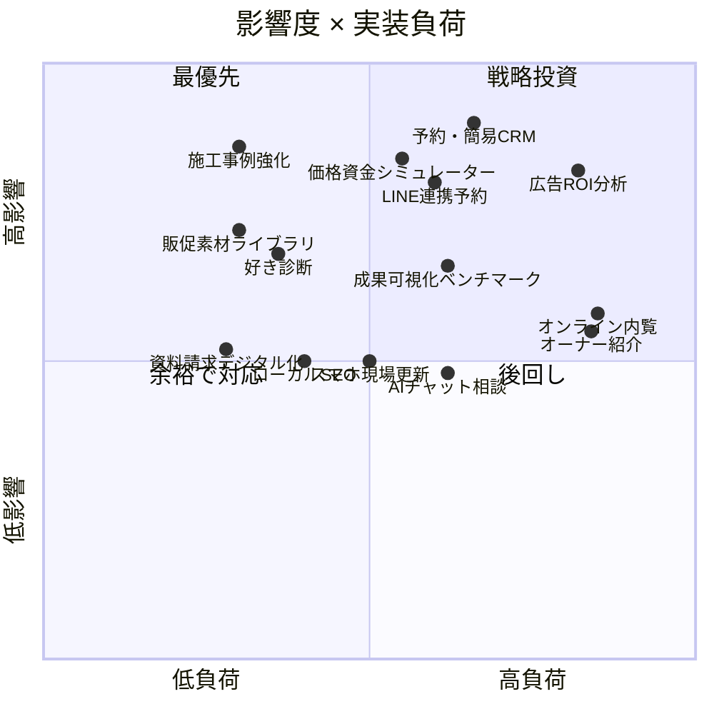
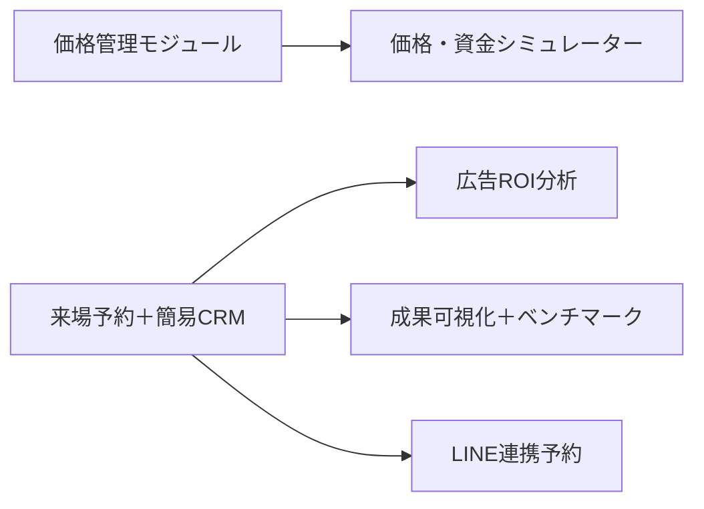

# 機能 優先度ロードマップ ― 影響度 × 実装負荷

対象：UNSTANDARDマルチテナントCMS（フランチャイズ版）に追加する機能オプション。
目的：全国の加盟店（工務店）が喜び、かつ家の販売・購入に貢献する機能を、影響度と実装負荷で優先順位づけする。
前提：いずれも既存のモジュール基盤に「オプション」として載る（加盟店ごとにON/OFF・課金可）。

---

## 評価の基準

- **影響度（高いほど良い）**：来場予約・成約への直結度／全加盟店への横展開価値／ブランド価値。
- **実装負荷（高いほど重い）**：開発量／外部連携（API）の有無／コンテンツ制作の重さ／他機能への依存。

区分の見方
- ★ **最優先**（高影響・低負荷＝クイックウィン）
- ◆ **戦略投資**（高影響・高負荷＝効くが作り込みが要る）
- ○ **余裕で対応**（中影響・低負荷）
- △ **後回し**（中影響・高負荷）
- ◎ **基盤**（単体価値は地味だが、他機能の前提になるイネーブラー）

---

## 影響度 × 実装負荷 マップ

---

## スコア表

| 機能 | 影響度 | 実装負荷 | 区分 | 主な狙い | 該当モジュール |
|------|:---:|:---:|:---:|------|------|
| 施工事例の強化＋絞り込み（動画・ビフォーアフター・予算/平屋/エリア/ライフスタイル） | 高 | 低 | ★ | 社会的証明で来場前の質を上げる。既存事例の拡張で済む | コンテンツ（コア拡張） |
| 販促素材ライブラリ（チラシ・SNS・広告素材を本部が配布） | 中高 | 低 | ★ | マーケ人材のない店もプロ品質で発信 | 本部配信 |
| “好き”診断 → おすすめ商品提案 | 中高 | 低中 | ★ | ブランド世界観で楽しくリード獲得 | 診断/リード |
| 資料請求デジタル化＋お気に入り・マイカタログ | 中 | 低 | ★/○ | 検討を前進させ離脱を防ぐ | リード/フォーム |
| 来場予約＋簡易CRM（空き枠・リマインド・対応状況管理） | 高 | 中高 | ◆/◎ | 取りこぼし・無断キャンセル削減。分析の土台 | 予約/CRM |
| 価格＆資金計画シミュレーター（総額＋ローン月々） | 高 | 中 | ◆ | 価格透明性で質の高いリード | 価格管理に連動 |
| 広告ROI分析（Meta連携＋流入分析） | 高 | 高 | ◆ | どの広告・コピーが予約を生むか可視化 | 分析 |
| LINE連携＋ワンタップ来場予約 | 高 | 中 | ◆ | 日本の検討者の主動線。再来訪促進 | 予約/通知 |
| 成果可視化＋全国ベンチマーク | 中高 | 中 | ◆ | 来場〜成約の見える化、横比較で動機づけ | 分析 |
| スマホ現場更新＋SNS自動連携 | 中 | 中 | ○ | 更新ハードルを下げる | コンテンツ |
| ローカルSEO／Googleビジネスプロフィール連携 | 中 | 低中 | ○ | 地域検索で見つかる | SEO |
| オンライン内覧（360°・動画ウォークスルー） | 中高 | 高 | △ | 遠隔検討の不安解消（制作負荷が重い） | コンテンツ |
| AIチャット相談（24時間・商品提案・予約誘導） | 中 | 中 | △ | 入口の摩擦低減 | AI/分析 |
| 引渡後オーナーコミュニティ＋紹介 | 中 | 高 | △ | 紹介の循環（長期効果） | コミュニティ |

> ※影響度・負荷は初期見積り。実装前にPoCや要件詳細化で再評価する前提。

---

## フェーズ別ロードマップ

### フェーズ0：基盤（イネーブラー）◎
他機能の前提になる土台を薄く先に。
- モジュール基盤（Registry／`tenantHasModule()`／拡張ポイント）
- 予約・問い合わせの受け皿（後のCRM・分析・LINEのデータ源）
- 価格管理モジュール（価格・資金シミュレーターの前提）

### フェーズ1：クイックウィン＋核 ★◆
早く価値を出し、現場の体験を一気に底上げ。
- 施工事例の強化＋絞り込み
- 販促素材ライブラリ
- “好き”診断 → おすすめ商品
- 資料請求デジタル化＋お気に入り
- 来場予約＋簡易CRM（核。フェーズ2の分析・LINEに繋がる）

### フェーズ2：高影響の戦略投資 ◆
リード獲得とROIを本格化。
- 価格＆資金計画シミュレーター
- 広告ROI分析（Meta連携＋流入分析）
- LINE連携＋ワンタップ予約
- 成果可視化＋全国ベンチマーク

### フェーズ3：深化 △
体験の作り込みと長期の循環。
- オンライン内覧（360°・動画）
- AIチャット相談
- 引渡後オーナーコミュニティ＋紹介
- ローカルSEO／GBP連携（負荷次第で前倒し可）

---

## 依存関係（順番を間違えないために）

- 価格・資金シミュレーターは **価格管理モジュール** が前提（加盟店別の正確な金額を出すため）。
- 広告ROI分析・成果可視化は、**予約/CRMがデータを取れている**ことが前提。
- LINE連携は **予約機能** に接続して初めて価値が出る。

---

## まとめ
- まず★（施工事例強化・販促素材・“好き”診断・資料請求）で早期に体験を底上げしつつ、◎の基盤と核の**予約＋CRM**を整える。
- 次に◆（価格・資金シミュレーター／広告ROI分析／LINE／成果可視化）でリード獲得とROIを本格化。
- △は体験の作り込みと長期循環として後段で。
- すべてオプション化されているため、加盟店のプランや希望に応じて段階提供・課金できる。
