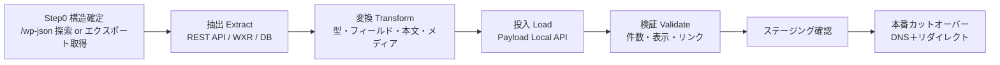

# WordPress移行 詳細設計 v1

新プラットフォーム（マルチテナントCMS）への移行を、棚卸し→テナント割り当て→変換ルール→リダイレクト表の順で設計する。
方針は「**データは移行、デザイン・機能は作り直し**」。

対象は既存の2サイト（いずれもWordPress前提）。
- 本部ブランドサイト：`unstandard.jp`
- 加盟店プラットフォーム：`unstandard-members.com`（LIFE QUARTET運営、各加盟店のサブサイト）

> 本書の各表は、実エクスポート取得後に「件数・スラッグ・ACFフィールド名」を確定して埋める**ひな型**である（§0 / §7）。

> ✅ **Step0 実施済み（2026-06-02）**：既存2サイトの構造を公開REST（`/wp-json`）から確定。確定データ・全66店のテナント対応表は **`07b_Step0_構造確定_対応表.md`** を参照。本書には主な確定値と修正点を反映済み（残るACF等はWXRで確定）。
>
> 主な修正点：①商品`lineup`は本部ではなく**加盟店サイト側**　②members.comは各店サブサイトではなく**単一WP・フラット構造**（`/works/<id>/`）　③加盟店マスターは本部の`stores`CPT（**全66店**）　④「本部事例」は`tag_works_headquarters`タクソノミー（15件）。

---

## 0. 進め方（パイプライン）

**Step0（最初の実務）**：WordPressの構造を確定する。`/wp-json/wp/v2/types`・`/wp-json/wp/v2/taxonomies` を確認、または WXR（エクスポート）/DB を取得し、カスタム投稿タイプ・タクソノミー・ACFフィールド・各件数を棚卸しする。以降の表はこの結果で確定する。

> ✅ **完了（2026-06-02）**：公開RESTでの構造確定・件数・タクソノミー・全66店テナント対応表は完了し `07b_Step0_構造確定_対応表.md` にまとめた。**残作業はWXRエクスポートでのACF確定**（価格・本文・日時・店舗紐付け）＝フェーズB。

---

## 1. 対象コンテンツの棚卸し（インベントリ）

公開構造から推定した一覧（確定値はStep0で確認）。

### 1.1 本部ブランドサイト `unstandard.jp`（Step0で確定）
| 区分 | 実WP種別 | 内容（例） | 件数 | 移行先（新基盤） |
|------|-----------|-----------|:---:|------|
| MEDIA記事 | CPT `media` | UNSTANDARD MEDIA（イエの探求、商品紹介 等） | 要確認※ | `posts`(media)（本部共有メディア） |
| NEWS | CPT `news` | お知らせ・新商品リリース 等 | 11 | `posts`(news)（本部共有） |
| 固定ページ | `page` | コンセプト、会社概要、プライバシーポリシー 等 | 35 | `pages`（本部） |
| 加盟店一覧 | CPT `stores` | 全国の加盟店・相談窓口（テナントマスター） | 66 | `tenants` マスター（§2・07b §3） |
| 都道府県マスタ | CPT `contact_prefectures` | お問い合わせフォーム用 | 47 | フォーム用select |
| メディア（画像） | 添付 `attachment` | 記事・店舗の画像 | 2688 | `media`（S3/R2へ再ホスト） |

> ※ `media`(MEDIA記事) CPTは attachment とREST衝突のため公開RESTで件数取得不可。WXRで確定（07b §8）。
> **商品ラインナップ(`lineup`)は本部サイトではなく加盟店サイト側にある** → §1.2 へ移動。
> メディアカテゴリ（ART&MUSIC 等）の実用語はWXRで確認（公開RESTでは未取得）。

### 1.2 加盟店プラットフォーム `unstandard-members.com`（Step0で確定）
| 区分 | 実WP種別 | 内容（例） | 件数 | 移行先 |
|------|-----------|-----------|:---:|------|
| 商品ラインナップ | CPT `lineup` | WOODBOX / NONDESIGN / コラボ各商品（HYLO 等） | 19 | `products`（本部共有・shared=true） |
| 施工事例 | CPT `works` | 各店の事例＋「本部事例」 | 18 | `posts`(works)：自店分はテナント、本部事例は共有 |
| イベント | CPT `event` | 完成見学会・相談会・セミナー 等 | 65 | `posts`(events) or 予約モジュール |
| お客様の声 | CPT `voice` | 事例に紐づく声（CALBUN 等） | 5 | `posts`(works)のフィールド or `testimonials` |
| トップスライダー | CPT `slider` | トップの訴求バナー | 29 | サイト設定 / Heroブロック |
| 固定ページ | `page` | お問い合わせ・加盟店募集・プライバシー | 7 | `pages` or 本部共通 |
| 店舗ページ | テーマ描画 `/<slug>/` | 18店が保有（hilaki, woodbox-osaka, itakura, harmony 等） | 18 | `tenants` 公開ページ |
| メディア（画像） | 添付 | 事例写真 等 | （添付） | `media`（テナント別、本部事例は共有） |

施工事例の分類（タクソノミー実値）：
- `tag_works`：NONDESIGN SERIES(6) / WOODBOX SERIES(9) / COLLABORATION(3) ／ 二階建て(13) / 平屋(5) / 狭小エリア向き(1) / モデルハウス(0)
- `tag_works_headquarters`：本部事例(15) ＝ 「本部事例」フラグ → `works.shared=true`
- `tag_event`：相談会(38) / キャンペーン(15) / 全国共通(7) / セミナー(6) / 常駐見学会(4) / 完成見学会(4) / モデルハウス見学会(3) / 資料請求(1)

> ✅ **構成判明**：members.com は **単一WordPress**（WP Multisiteではない）。店舗別パス `/<slug>/` は単一サイト内のテーマ描画ページで、独立サブサイトではない（サブパスの`wp-json`は404）。
> よって「各サイト＝テナント」ではなく、**各 works/event/voice をコンテンツ側の紐付け（ACF/タクソノミー）でテナントへ写像**する。その紐付けフィールドは公開REST非露出 → WXRで確定（07b §8）。
> **加盟店マスター（住所・エリア・連絡先・外部URL）は本部 `unstandard.jp` の `stores` CPT（全66店）側**にある（§2・07b §3）。

---

## 2. テナント割り当てルール

「本部が中央管理する共有」と「加盟店ローカル」を分けるのが核。

| 判定 | ルール | 割り当て |
|------|--------|----------|
| 商品・ブランドメディア・コンセプト | `unstandard.jp` 由来 | **本部共有**（`shared=true`、全店配信） |
| 「本部事例」フラグ付きの施工事例 | works のうち本部提供 | **本部共有** |
| 各加盟店の施工事例・イベント・お客様の声・店舗情報 | `unstandard-members.com/＜store＞/` 配下 | **その加盟店テナント**（URLの店舗スラッグ＝tenant） |
| お問い合わせ・加盟店募集・プライバシー | 全店共通の固定ページ | **本部共通**（各店で表示） |

**マッピング鍵**：加盟店マスターは本部 `unstandard.jp` の `stores` CPT（全66店・WP store-idで一意）。「加盟店名 ↔ エリア ↔ members.comページslug ↔ 新tenant-slug」の対応表は **07b §3 に作成済み**（18店はmembers.comのclean slugを採用）。
各 works/event/voice を **どのテナントへ割り当てるか** は、members.com側の紐付けフィールド（ACF/タクソノミー、公開REST非露出）で決まるため、WXR取得後に `tenant`（または `shared`）を確定付与する。「本部事例」は `tag_works_headquarters` により `shared=true` と判定。

---

## 3. 変換ルール

### 3.1 投稿タイプ → コレクション
| WordPress | 新コレクション | 主なフィールド対応 |
|-----------|---------------|--------------------|
| `post`（メディア） | `posts` | title→title, slug→slug, content→content(richText), date→publishedAt, excerpt→excerpt, eyecatch→coverImage, category→カテゴリ |
| `works`（施工事例） | `posts`(works) | title, slug, ギャラリー画像→media配列, シリーズ/構造→タグ, 本部事例→shared, お客様の声→testimonialフィールド |
| `event`（見学会等） | `posts`(events) or 予約 | title, 開催日時, 場所, 予約要否→status/予約モジュール |
| `lineup`（商品） | `products`(共有) | name, series, 説明→richText, 価格→standardPrice（任意）, 画像→media |
| `page` | `pages` | title, slug, 本文→ブロック(richText) |
| 添付（画像） | `media` | ファイル→S3/R2再アップ, alt, 本文内URL書き換え |

### 3.2 タクソノミー → タグ/選択肢
- シリーズ：`NONDESIGN / WOODBOX / COLLABORATION` → `series`（select）。
- 構造・属性：`平屋 / 二階建て / 狭小エリア向き / モデルハウス` → `tags`（multi）。
- メディアカテゴリ（ART&MUSIC 等）→ `posts.category`（select or relation）。
- 用語の表記ゆれはStep0で正規化辞書を作り統一する。

### 3.3 リッチテキスト（最重要・手当て要）
- WordPress本文（HTML／Gutenbergブロック／ショートコード）→ Payloadの **lexical** へ変換。
- 手順：HTMLパース → 見出し/段落/リスト/画像/リンク/引用を lexicalノードへマッピング → ショートコード・プラグイン依存記法は個別ルールで置換 or 除去 → 目視サンプリングで整形確認。
- 画像は本文中も `media` 参照へ差し替え（S3/R2のURL）。

### 3.4 メディア
- 添付を取得し S3/R2 へ再アップロード。テナント別（本部事例は共有）にスコープ。
- 本文・ギャラリー内の旧URL（`wp-content/uploads/...`）を新URLへ一括置換。
- alt・キャプションを保持。

### 3.5 公開状態・メタ
- `publish`→published、`draft/private`→draft。
- 公開日・著者は可能な範囲で保持。
- SEO（旧プラグインのtitle/description）→ `seoDefault`/各ページSEOへ移行。

---

## 4. リダイレクト表（SEO維持）

旧URLはすべて **数値IDベース**（Step0で確定）。原則 **301**。確定パターンとid→slug生成方針は **07b §6** を参照。

### 4.1 本部 `unstandard.jp`
| 旧URL（実パターン） | 新URL（案） | 種別 |
|------------------|------------------|:---:|
| `/`（トップ） | `/`（本部トップ） | 301 |
| `/media/＜id＞/`（MEDIA記事） | `/media/＜slug＞` | 301（id→slug対応表が必要） |
| `/news/＜jp-slug＞/`（NEWS） | `/news/＜slug＞` | 301（現slugは日本語・要正規化） |
| `/stores/＜jp-slug＞/`（加盟店） | `/＜tenant＞` or `/stores/＜tenant＞` | 301（store-id→tenant＝07b §3） |
| `/会社概要`・`/privacy` 等（固定ページ） | 対応する固定ページ | 301 |

> ⚠️ 商品（`/lineup/...`）は本部ではなく**加盟店サイト側**（§4.2）。

### 4.2 加盟店 `unstandard-members.com`
| 旧URL（実パターン） | 新URL（案） | 種別 |
|------------------|------------------|:---:|
| `/＜store-slug＞/`（店トップ・18店） | `/＜tenant＞`（店トップ） | 301 |
| `/works/＜id＞/`（事例詳細） | `/works/＜slug＞` or `/＜tenant＞/works/＜slug＞` | 301（id→slug＋tenant対応表が必要） |
| `/lineup/＜id＞/`（商品詳細） | `/products/＜slug＞` | 301（id→slug対応表が必要） |
| `/event/＜id＞/`（見学会等） | `/events/＜slug＞` or `/＜tenant＞/events/＜slug＞` | 301 |
| `/voice/＜id＞/`（お客様の声） | works/testimonials へ統合 | 301（紐付け先はWXRで確定） |
| `/お問い合わせ`・`/加盟店募集`（固定ページ） | 対応ページ | 301 |

> `/＜store＞/works/` のような店舗別パスは**存在しない**（単一WP・フラット構造）。id→slug／id→tenant の対応表はWXRから生成して個別301を発行する。

> ドメイン継続：`unstandard.jp` はそのまま本部、加盟店は現行どおり `unstandard-members.com/＜store＞`（または将来サブドメイン/独自ドメイン）。**id付きURL（`/works/406/`・`/media/047/`）は、移行時にidとslug/テナントの対応表を生成して個別301**を発行する。

---

## 5. エッジケース・手動レビュー

- 重複・空・テスト投稿の除外。
- 「本部事例」と各店の独自事例の取り違え防止（共有/テナントの誤割り当てチェック）。
- ショートコード・埋め込み（Instagram、地図、フォーム）の置換方針。
- 旧フォーム（お問い合わせ）の送信先・項目を新フォームへ再設計（個人情報の同意文言も更新）。
- 文字化け・全角半角・タグ崩れのサンプリング目視。

---

## 6. 検証チェックリスト

- 件数一致（投稿タイプ別の旧→新の件数）。
- ランダム抽出での本文・画像・リンクの表示確認。
- テナント割り当ての正しさ（他店に混入していないか＝分離確認）。
- 主要旧URLの301到達確認（リダイレクトマップの網羅）。
- 公開/下書きステータスの一致、SEOメタの引き継ぎ。
- 画像のS3/R2配信と本文内URL置換の確認。

---

## 7. カットオーバー手順（本番切替）

1. ステージングで全件移行・検証を完了。
2. リダイレクトマップを確定（id→新URL対応表を含む）。
3. DNSのTTLを事前短縮。
4. 切替（DNSを新ホスティングへ）。301リダイレクトを有効化。
5. 切替直後の監視（404・エラー・主要導線）。
6. サーチコンソール等へサイトマップ送信、インデックス状況を追跡。

---

## 8. Step0の確定状況

**✅ 確定済み（公開REST・2026-06-02／詳細は 07b）：**
- WordPressの構成 → **両サイトとも単一WP**（Multisiteではない）。
- カスタム投稿タイプ・タクソノミーの正式名と**公開件数**（07b §2）。
- タクソノミーの実用語（シリーズ・構造・イベント種別・本部事例フラグ）。
- 加盟店マスター（全66店）と「加盟店名 ↔ エリア ↔ members.comページ ↔ 新tenant-slug案」対応表（07b §3）。
- 旧URLの実構造（数値IDベース）とリダイレクト方針（07b §6）。

**🔲 残作業（WXRエクスポートで確定＝フェーズB）：**
- `lineup`/`event`/`voice`/`works`/`news` のACFフィールド名と値（価格・本文・開催日時・ギャラリー等）。
- `media`(MEDIA記事) CPTの正確な件数（attachmentとREST衝突）。
- 各 works/event/voice の**加盟店紐付け**（テナント割り当ての鍵）と本部事例の個別id。
- `/works/＜id＞/`・`/lineup/＜id＞/`・`/media/＜id＞/` の id→slug 対応表（リダイレクト個別生成の前提）。
- 下書き/非公開を含む総件数、メディアカテゴリの実用語。
- 旧フォーム（Contact Form 7 を確認）/プラグイン依存機能の取り扱い（再設計範囲）。
