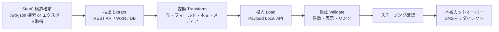

# WordPress移行 詳細設計 v1

新プラットフォーム（マルチテナントCMS）への移行を、棚卸し→テナント割り当て→変換ルール→リダイレクト表の順で設計する。
方針は「**データは移行、デザイン・機能は作り直し**」。

対象は既存の2サイト（いずれもWordPress前提）。
- 本部ブランドサイト：`unstandard.jp`
- 加盟店プラットフォーム：`unstandard-members.com`（LIFE QUARTET運営、各加盟店のサブサイト）

> 本書の各表は、実エクスポート取得後に「件数・スラッグ・ACFフィールド名」を確定して埋める**ひな型**である（§0 / §7）。

---

## 0. 進め方（パイプライン）

**Step0（最初の実務）**：WordPressの構造を確定する。`/wp-json/wp/v2/types`・`/wp-json/wp/v2/taxonomies` を確認、または WXR（エクスポート）/DB を取得し、カスタム投稿タイプ・タクソノミー・ACFフィールド・各件数を棚卸しする。以降の表はこの結果で確定する。

---

## 1. 対象コンテンツの棚卸し（インベントリ）

公開構造から推定した一覧（確定値はStep0で確認）。

### 1.1 本部ブランドサイト `unstandard.jp`
| 区分 | 推定WP種別 | 内容（例） | 件数 | 移行先（新基盤） |
|------|-----------|-----------|:---:|------|
| 商品ラインナップ | カスタム投稿 `lineup` 等 | WOODBOX / NONDESIGN / コラボ各商品（CALBUN, BUNGALOW 等） | TBD | `products`（本部共有・shared=true） |
| メディア記事 | 投稿 `post` | UNSTANDARD MEDIA（イエの探求、商品紹介 等） | TBD | `posts`（本部共有メディア） |
| メディアのカテゴリ | タクソノミー | ART&MUSIC / COLORFUL / CULTURE / FASHION / FOOD&HEALTH / GARAGE LIFE / GREEN LIFE / KIDS&PET / OUTDOOR / PRODUCT / VINTAGE&ANTIQUE | — | `posts`のカテゴリ（select/relation） |
| 固定ページ | `page` | コンセプト、会社概要、プライバシーポリシー 等 | TBD | `pages`（本部） |
| メディア（画像） | 添付 | 商品・記事の画像 | TBD | `media`（S3/R2へ再ホスト） |

### 1.2 加盟店プラットフォーム `unstandard-members.com`
| 区分 | 推定WP種別 | 内容（例） | 件数 | 移行先 |
|------|-----------|-----------|:---:|------|
| 加盟店（店舗） | サイト/タクソノミー/カスタム投稿 | 各加盟店（/hilaki/ /woodbox-osaka/ /soutaku/ /itakura/ /harmony/ /endo-kenchiku/ 等） | TBD | `tenants`（=加盟店） |
| 施工事例 | カスタム投稿 `works` | 各店の事例＋「本部事例」 | TBD | `posts`(works)：自店分はテナント、本部事例は共有 |
| 施工事例の分類 | タクソノミー | NONDESIGN / WOODBOX / COLLABORATION ／ 平屋・二階建て・狭小・モデルハウス | — | タグ/select |
| イベント | カスタム投稿 `event` 等 | 完成見学会・相談会（予約制） | TBD | `posts`(events) or 予約モジュール |
| お客様の声 | カスタム投稿/ACF | 事例に紐づく声（LOSPA 等） | TBD | `posts`(works)のフィールド or `testimonials` |
| 店舗情報 | ACF/オプション | 住所・エリア・連絡先・スタッフ | TBD | `site_settings`（テナント） |
| 商品ラインナップ | 本部から共有表示 | 本部の商品を各店で表示 | — | `products`(共有)を参照 |
| 固定ページ | `page` | お問い合わせ・加盟店募集・プライバシー | TBD | `pages` or 本部共通 |
| メディア（画像） | 添付 | 事例写真 等 | TBD | `media`（テナント別、本部事例は共有） |

> マルチサイト（WP Multisite）構成か、単一WP＋店舗タクソノミーかをStep0で確認。前者なら各サイト＝テナント、後者なら店舗タクソノミー＝テナントへ写像する。

---

## 2. テナント割り当てルール

「本部が中央管理する共有」と「加盟店ローカル」を分けるのが核。

| 判定 | ルール | 割り当て |
|------|--------|----------|
| 商品・ブランドメディア・コンセプト | `unstandard.jp` 由来 | **本部共有**（`shared=true`、全店配信） |
| 「本部事例」フラグ付きの施工事例 | works のうち本部提供 | **本部共有** |
| 各加盟店の施工事例・イベント・お客様の声・店舗情報 | `unstandard-members.com/＜store＞/` 配下 | **その加盟店テナント**（URLの店舗スラッグ＝tenant） |
| お問い合わせ・加盟店募集・プライバシー | 全店共通の固定ページ | **本部共通**（各店で表示） |

**マッピング鍵**：URLパスの店舗スラッグ（例 `/hilaki/`）→ `tenants.slug`。Step0で「店舗スラッグ ↔ 加盟店名 ↔ tenant」の対応表を作成し、全コンテンツに `tenant`（または `shared`）を付与する。

---

## 3. 変換ルール

### 3.1 投稿タイプ → コレクション
| WordPress | 新コレクション | 主なフィールド対応 |
|-----------|---------------|--------------------|
| `post`（メディア） | `posts` | title→title, slug→slug, content→content(richText), date→publishedAt, excerpt→excerpt, eyecatch→coverImage, category→カテゴリ |
| `works`（施工事例） | `posts`(works) | title, slug, ギャラリー画像→media配列, シリーズ/構造→タグ, 本部事例→shared, お客様の声→testimonialフィールド |
| `event`（見学会等） | `posts`(events) or 予約 | title, 開催日時, 場所, 予約要否→status/予約モジュール |
| `lineup`（商品） | `products`(共有) | name, series, 説明→richText, 価格→standardPrice（任意）, 画像→media |
| `page` | `pages` | title, slug, 本文→ブロック(richText) |
| 添付（画像） | `media` | ファイル→S3/R2再アップ, alt, 本文内URL書き換え |

### 3.2 タクソノミー → タグ/選択肢
- シリーズ：`NONDESIGN / WOODBOX / COLLABORATION` → `series`（select）。
- 構造・属性：`平屋 / 二階建て / 狭小エリア向き / モデルハウス` → `tags`（multi）。
- メディアカテゴリ（ART&MUSIC 等）→ `posts.category`（select or relation）。
- 用語の表記ゆれはStep0で正規化辞書を作り統一する。

### 3.3 リッチテキスト（最重要・手当て要）
- WordPress本文（HTML／Gutenbergブロック／ショートコード）→ Payloadの **lexical** へ変換。
- 手順：HTMLパース → 見出し/段落/リスト/画像/リンク/引用を lexicalノードへマッピング → ショートコード・プラグイン依存記法は個別ルールで置換 or 除去 → 目視サンプリングで整形確認。
- 画像は本文中も `media` 参照へ差し替え（S3/R2のURL）。

### 3.4 メディア
- 添付を取得し S3/R2 へ再アップロード。テナント別（本部事例は共有）にスコープ。
- 本文・ギャラリー内の旧URL（`wp-content/uploads/...`）を新URLへ一括置換。
- alt・キャプションを保持。

### 3.5 公開状態・メタ
- `publish`→published、`draft/private`→draft。
- 公開日・著者は可能な範囲で保持。
- SEO（旧プラグインのtitle/description）→ `seoDefault`/各ページSEOへ移行。

---

## 4. リダイレクト表（SEO維持）

旧URL構造 → 新URL構造の対応（パターン）。確定スラッグはStep0後に展開。原則 **301**。

### 4.1 本部 `unstandard.jp`
| 旧URL（パターン） | 新URL（パターン） | 種別 |
|------------------|------------------|:---:|
| `/`（トップ） | `/`（本部トップ） | 301 |
| `/lineup/`（商品一覧） | `/lineup`（商品一覧） | 301 |
| `/lineup/＜product＞/` | `/products/＜product＞` | 301 |
| `/media/`（記事一覧） | `/media` | 301 |
| `/media/＜id or slug＞/` | `/media/＜slug＞` | 301（id→slug対応表が必要） |
| `/会社概要`・`/privacy` 等 | 対応する固定ページ | 301 |

### 4.2 加盟店 `unstandard-members.com`
| 旧URL（パターン） | 新URL（パターン） | 種別 |
|------------------|------------------|:---:|
| `/＜store＞/`（店トップ） | `/＜tenant＞`（店トップ） | 301 |
| `/＜store＞/works/`（事例一覧） | `/＜tenant＞/works` | 301 |
| `/works/＜id＞/`（事例詳細） | `/＜tenant＞/works/＜slug＞` | 301（id→tenant+slug対応表が必要） |
| `/＜store＞/event/...`（見学会） | `/＜tenant＞/events/＜slug＞` | 301 |
| `/store/`（加盟店一覧） | `/stores`（全国の加盟店） | 301 |
| `/お問い合わせ`・`/加盟店募集` | 対応ページ | 301 |

> ドメイン継続：`unstandard.jp` はそのまま本部、加盟店は現行どおり `unstandard-members.com/＜store＞`（または将来サブドメイン/独自ドメイン）。**id付きURL（`/works/406/`・`/media/047/`）は、移行時にidとslug/テナントの対応表を生成して個別301**を発行する。

---

## 5. エッジケース・手動レビュー

- 重複・空・テスト投稿の除外。
- 「本部事例」と各店の独自事例の取り違え防止（共有/テナントの誤割り当てチェック）。
- ショートコード・埋め込み（Instagram、地図、フォーム）の置換方針。
- 旧フォーム（お問い合わせ）の送信先・項目を新フォームへ再設計（個人情報の同意文言も更新）。
- 文字化け・全角半角・タグ崩れのサンプリング目視。

---

## 6. 検証チェックリスト

- 件数一致（投稿タイプ別の旧→新の件数）。
- ランダム抽出での本文・画像・リンクの表示確認。
- テナント割り当ての正しさ（他店に混入していないか＝分離確認）。
- 主要旧URLの301到達確認（リダイレクトマップの網羅）。
- 公開/下書きステータスの一致、SEOメタの引き継ぎ。
- 画像のS3/R2配信と本文内URL置換の確認。

---

## 7. カットオーバー手順（本番切替）

1. ステージングで全件移行・検証を完了。
2. リダイレクトマップを確定（id→新URL対応表を含む）。
3. DNSのTTLを事前短縮。
4. 切替（DNSを新ホスティングへ）。301リダイレクトを有効化。
5. 切替直後の監視（404・エラー・主要導線）。
6. サーチコンソール等へサイトマップ送信、インデックス状況を追跡。

---

## 8. 未確定（Step0で確定する項目）

- WordPressの構成（Multisite か 単一WP＋タクソノミーか）。
- カスタム投稿タイプ・タクソノミー・ACFフィールドの正式名と件数。
- 店舗スラッグ ↔ 加盟店名 ↔ tenant の対応表。
- `/works/＜id＞/`・`/media/＜id＞/` の id→slug 対応表（リダイレクト生成の前提）。
- 旧フォーム/プラグイン依存機能の取り扱い（再設計範囲）。
